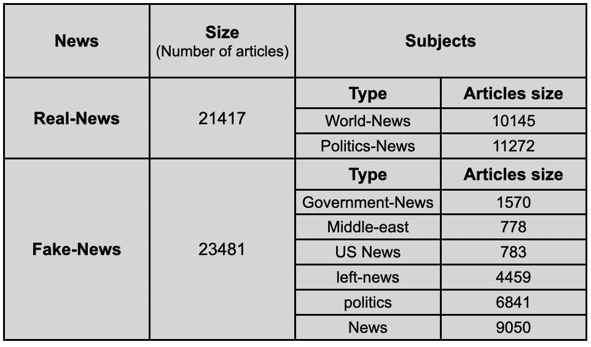
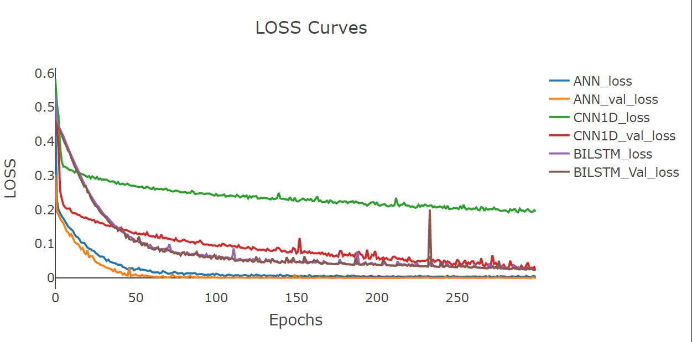

# Fake News Detection

## Introduction
Fake News Detection using AI is a project aimed at combatting misinformation and upholding online information credibility. The use of AI-powered fake news detection enables quick identification of deceptive content amid vast data, protecting public discussions from false facts and ensuring that we can trust the news sources we rely on.

## Dataset - [ISOT Fake News](https://onlineacademiccommunity.uvic.ca/isot/2022/11/27/fake-news-detection-datasets/)
The dataset used for this project contains two types of articles: fake and real news. It was collected from real-world sources, with truthful articles obtained by crawling articles from Reuters.com, a reputable news website. The fake news articles, on the other hand, were collected from various unreliable websites that were flagged by Politifact, a fact-checking organization in the USA, and Wikipedia. The dataset consists of different types of articles covering various topics, but the majority of them focus on political and world news topics.

The dataset is provided in two CSV files:
1. `True.csv` - Contains more than 12,600 articles from [Reuters.com](https://www.reuters.com/).
2. `Fake.csv` - Contains more than 12,600 articles from different fake news outlet resources.

Each article in the dataset includes the following information:
- Article title
- Text
- Type (real or fake)
- Date the article was published on

The data collected for [Kaggle.com](https://kaggle.com/) primarily covers articles from 2016 to 2017. The data were cleaned and processed, with the punctuations and mistakes in the fake news articles retained in the text.

The following table gives a breakdown of the categories and the number of articles per category:




## Data Preprocessing
The data preprocessing steps for the text data are as follows:
- Text Cleaning: Removing unwanted characters, symbols, or special characters from the text.
- Tokenization: Breaking down the cleaned text into individual words or tokens.
- Lowercasing: Converting all tokens to lowercase for uniformity.
- Stopword Removal: Removing common words that do not carry significant meaning.
- Lemmatization/Stemming: Reducing words to their base or root form.
- Word Vectorization: Using Word2Vec to generate word embeddings, representing the text in a numerical format.

Null value handling is performed during word vectorization to remove entries with null values in the word vectors.

## Methods
In this project, three different AI approaches are used for fake news detection:

### Artificial Neural Network approach (MLP):
The MLP model employs a classical combination of linear layers with LeakyReLU and sigmoid activations. Dropout is applied to enhance generalization in the model.

### Convolutional Neural Network approach (CNN1D):
The CNN1D model is used for feature extraction using 1D convolution, which is effective for sequence analysis. Subsequent classification is performed using an MLP.

### Recurrent Neural Network approach (LSTM):
The LSTM model utilizes a Bi-directional LSTM layer for empowering sequence extraction. The subsequent classification is performed using an MLP.

## Conclusion



### Model Training
All models underwent rigorous training for 300 Epochs.

### Loss Function
The binary Cross Entropy loss (BCE) was meticulously optimized during training.

### Optimizer
The ADAM optimizer, with a fixed learning rate of 3e-4, was utilized for enhanced performance.

### Performance Ranking
After evaluating the models, the performance ranking was as follows:
1. Artificial Neural Network (ANN)
2. Bidirectional LSTM (BILSTM)
3. Convolutional Neural Network (CNN1D)

## How to Use - Demo

Follow the steps below to use the "Fake News Detection" models using the provided Colab notebook:

1. Open the Colab notebook titled `Colab_Test.ipynb`.

2. Ensure you have access to the required necessary files.

3. Use the following command to test a specific model:

```python
!python test.py --model "Model name" --colab True
```
- Replace "Model name" with the name of the model you want to test. The available model names are: ANN, CNN1D, and LSTM.

The script will load the selected model and use it to detect fake news from the provided dataset.
